# VertexFactory 从顶点数据到 Shader (一): C++ VertexFactory

VertexFactory 是 Unreal MeshDrawPipeline 的一部分，主要负责对 Mesh 顶点数据的处理与传递到 VertexShader 和 VertexShader 的部分实现(VertexFactory.ush). 

本系列文章将阐述如何自定义VertexFactory以传递顶点数据到Shader, 最终会绘制出一个正方形到场景中. 源码还会附带 Instancing 相关内容, 但文中不会过多展开说明.

本篇文章是本系列文章的第一篇, 主要说明自定义顶点数据, 以及 C++ 端 VertexFactory 的自定义.

## 流程

### 顶点数据


首先, 我们需要自定义 VertexBuffer 与 IndexBuffer 结构体. 

#### VertexBuffer

要自定义 VertexBuffer, 我们需要继承 FVertexBuffer 结构体, 先看一下 FVertexBuffer 的代码:

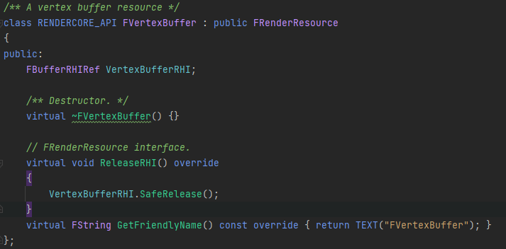

FVertexBuffer 继承了 FRenderResource. RenderResource 类会封装 RHI 资源, 而FVertexBuffer 包含名为 VertexBufferRHI 的成员变量, 并实现了释放资源的函数 ReleaseRHI(). 我们继承了 FVertexBuffer 后, 需要重载 InitRHI() 函数, 在其中使用顶点信息初始化 VertexBufferRHI.

本例中, 我们创建一个表示顶点位置的 VertexBuffer, 单个 Element 类型为 float4. 

首先, 在 InitRHI() 中创建 VertexBufferRHI, 如下图所示, 其中 FVertexInput = FVector4f.

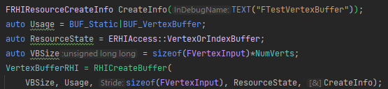

其中 Usage 的 BUF_Static 对应 DX12 Default Heap 中的 Resource, BUF_VertexBuffer 则标记这个 Buffer 是 VertexBuffer (本人理解: 由于DX12所有Buffer都是ID3DResource*, 所以这个标记没有实质性的作用). 而 ResourceState 则对应 DX12 的 D3D12_RESOURCE_STATE.

接下来向 Buffer 中写入数据, 如下图所示. 

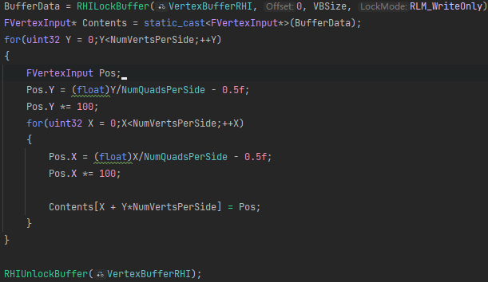

使用 RHILockBuffer 获取 Buffer 的地址, 并向其中写入数据, 这里我们以先行后列的顺序写入网格顶点的 Position, 最后Unlock. 

#### IndexBuffer

然后定义 IndexBuffer. 定义 IndexBuffer 也需要继承 FIndexBuffer, 其结构与 FVertexBuffer 相似. 创建 IndexBufferRHI 时, 我们使用在创建时就传入Index数据的方式, 如下图所示:

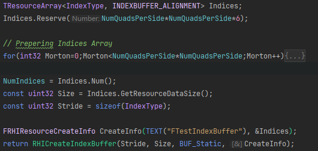

将生成的 Index 填入 TResourceArray 后, 将 TResourceArray 设置到 CreateInfo 中, 在 CreateBuffer 时就能将数据上传到 Buffer 里.

#### 完整代码

VertexBuffer 与 IndexBuffer 的完整代码如下:
<details>
<summary>点击查看完整代码</summary>


``` cpp
// TestVertexBuffer
class FTestVertexBuffer: public FVertexBuffer
{
public:
    FTestVertexBuffer(int32 InNumQuadsPerSide): NumQuadsPerSide(InNumQuadsPerSide){}

	using FVertexInput = FVector4f;
    
    virtual void InitRHI() override{
    	const uint32 NumVertsPerSide = NumQuadsPerSide+1;
    	NumVerts = NumVertsPerSide*NumVertsPerSide;
    	void* BufferData = nullptr;

    	FRHIResourceCreateInfo CreateInfo(TEXT("FTestVertexBuffer"));
    	auto Usage = BUF_Static|BUF_VertexBuffer;
    	auto ResourceState = ERHIAccess::VertexOrIndexBuffer;
    	auto VBSize = sizeof(FVertexInput)*NumVerts;
    	VertexBufferRHI = RHICreateBuffer(
    		VBSize, Usage, sizeof(FVertexInput), ResourceState, CreateInfo);
    	BufferData = RHILockBuffer(VertexBufferRHI, 0, VBSize, RLM_WriteOnly);
    	FVertexInput* Contents = static_cast<FVertexInput*>(BufferData);
    	for(uint32 Y = 0;Y<NumVertsPerSide;++Y)
    	{
    		FVertexInput Pos;
    		Pos.Y = (float)Y/NumQuadsPerSide - 0.5f;
    		Pos.Y *= 100;
    		for(uint32 X = 0;X<NumVertsPerSide;++X)
    		{
    			Pos.X = (float)X/NumQuadsPerSide - 0.5f;
    			Pos.X *= 100;
    			
    			Contents[X + Y*NumVertsPerSide] = Pos;
    		}
    	}

    	RHIUnlockBuffer(VertexBufferRHI);
    }
    
    int32 GetVertexCount() const {return NumVerts;}
    
private:
    int32 NumVerts = 0;
    const int32 NumQuadsPerSide = 0;
};

```

```cpp
// IndexBuffer
class FTestIndexBuffer: public FIndexBuffer
{
public:
	FTestIndexBuffer(int32 InNumQuadsPerSide) : NumQuadsPerSide(InNumQuadsPerSide){};

	virtual void InitRHI() override
	{
		if(NumQuadsPerSide < 256)
		{
			IndexBufferRHI = CreateIndexBuffer<uint16>();
		}
		else
		{
			IndexBufferRHI = CreateIndexBuffer<uint32>();
		}
	}

	int32 GetIndexCount() const {return NumIndices;}
private:
	template <typename IndexType>
	FBufferRHIRef CreateIndexBuffer()
	{
		TResourceArray<IndexType, INDEXBUFFER_ALIGNMENT> Indices;
		Indices.Reserve(NumQuadsPerSide*NumQuadsPerSide*6);

		// Prepering Indices Array
		for(int32 Morton=0;Morton<NumQuadsPerSide*NumQuadsPerSide;Morton++)
		{
			// Z-Order
			int32 X = FMath::ReverseMortonCode2(Morton);
			int32 Y = FMath::ReverseMortonCode2(Morton >> 1);

			bool ForwardDiagonal = false; // Quad Is Z-Shape

			if (X % 2)
			{
				ForwardDiagonal = !ForwardDiagonal;
			}
			if(Y % 2)
			{
				ForwardDiagonal = !ForwardDiagonal;
			}

			// Z-Order Idx: Left-Up, Right-Up, Left-Down, Right-Down
			int32 Index0 = X + Y * (NumQuadsPerSide+1);
			int32 Index1 = Index0 +1;
			int32 Index2 = Index0 + NumQuadsPerSide + 1;
			int32 Index3 = Index2 + 1;

			Indices.Add(Index3);
			Indices.Add(Index1);
			Indices.Add(ForwardDiagonal? Index2: Index0);
			Indices.Add(Index0);
			Indices.Add(Index2);
			Indices.Add(ForwardDiagonal? Index1: Index3);
		}
		
		NumIndices = Indices.Num();
		const uint32 Size = Indices.GetResourceDataSize();
		const uint32 Stride = sizeof(IndexType);

		FRHIResourceCreateInfo CreateInfo(TEXT("FTestIndexBuffer"), &Indices);
		return RHICreateIndexBuffer(Stride, Size, BUF_Static, CreateInfo);
	}

	int32 NumIndices = 0;
	const int32 NumQuadsPerSide = 0;
}
```

</details>

### 自定义 VertexFactory

有了顶点数据, 接下来就要告知 Shader 顶点数据的类型, 以及将数据传入到 Shader 中. 通过自定义 VertexFactory 可以完成这两个任务, 主要是在重载的 InitRHI() 函数中进行.

要自定义 VertexFactory, 我们要继承 FVertexFactory 结构体, 并编写对应的 VertexFactory.ush Shader代码.

继承FVertexFactory, 如下图所示:

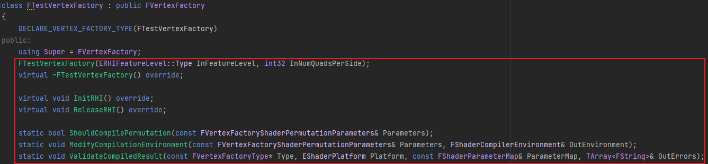

#### 宏

在 VertexFactory 类声明开头加上 `DECLARE_VERTEX_FACTORY_TYPE`, cpp 文件中加入 `IMPLEMENT_VERTEX_FACTORY_TYPE`, 如图:

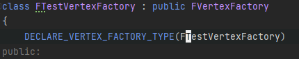
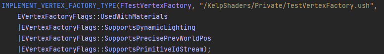!

其中 VertexFactory 的实现宏需要指定 Shader 文件的位置与 Flags. Shader 文件位置可以使用 `AddShaderSourceDirectoryMapping` 映射来得到, 此处不展开. 对于Flags, 前三个分别是支持材质, 动态光源, 精确的上一帧世界坐标( 目前没有实质作用 ), 而最后一个与 GPUScene 有关.

#### Vertex/IndexBuffer与VertexDeclaration

在 InitRHI() 初始化 Vertex/IndexBuffer

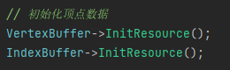

接下来要创建 VertexDeclaration, 用于定义 VertexInput 的结构. 首先我们需要填充 FVertexStreamComponent 结构体, 这个结构体记录单个 VertexAttribute 的信息, 包括 VertexBuffer 与顶点描述.

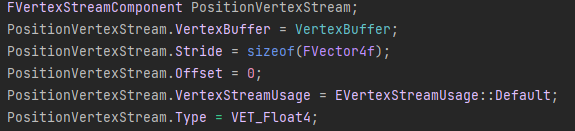

下一步, 用 FVertexStreamComponent 生成 FVertexElemt. FVertexElement 只包含顶点信息, 是之后用来生成 VertexDeclaration 的结构体, 而 AccessStreamComponent 函数会将 FVertexStreamComponent 中的 Vertexbuffer 及附加信息提取出来并加入到 Streams 数组中, 并返回 FVertexElement. Streams 数组保存的数据最终会在绘制时绑定到 VertexShader 上.

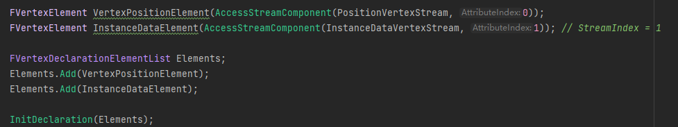

最后将生成的 `FVertexElement` 放入数组, 调用 `InitDeclaration`, VertexFactory 就会在内部自动创建 VertexDeclaration.

#### UniformBuffer

我们还需要在 VertexFactory 中创建一个 UniformBuffer, 用来控制顶点颜色.

首先在头文件中定义 UniformBuffer 结构, 并在 CPP 文件中实现它. 我们将 `FTestVFParameters` 结构体绑定到 Shader 的 `TestVF` 变量上, 这样在 Shader 中可以直接使用类似 `TestVF.Color` 的代码来访问其数据.

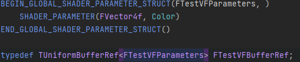
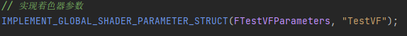

将 `FTestVFBufferRef` 添加到成员变量中, 然后在 `InitRHI()` 函数中创建 UniformBuffer. 这里设置 Color 为蓝色.

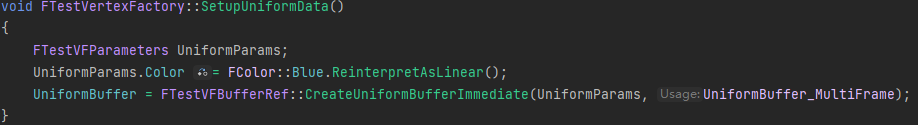

#### 完整代码

VertexFactory 的完整代码如下:

<details>
<summary>点击查看完整代码</summary>

```cpp
// .h
class FTestVertexFactory : public FVertexFactory
{
	DECLARE_VERTEX_FACTORY_TYPE(FTestVertexFactory)
public:
	using Super = FVertexFactory;
	FTestVertexFactory(ERHIFeatureLevel::Type InFeatureLevel, int32 InNumQuadsPerSide);
	virtual ~FTestVertexFactory() override;

	virtual void InitRHI() override;
	virtual void ReleaseRHI() override;
	
	static bool ShouldCompilePermutation(const FVertexFactoryShaderPermutationParameters& Parameters);
	static void ModifyCompilationEnvironment(const FVertexFactoryShaderPermutationParameters& Parameters, FShaderCompilerEnvironment& OutEnvironment);
	static void ValidateCompiledResult(const FVertexFactoryType* Type, EShaderPlatform Platform, const FShaderParameterMap& ParameterMap, TArray<FString>& OutErrors);
	
	inline FUniformBufferRHIRef GetTestVFUniformBuffer() const {return UniformBuffer;}

	inline FTestVertexBuffer* GetVertexBuffer() const {return VertexBuffer;}
	inline FTestIndexBuffer* GetIndexBuffer() const {return IndexBuffer;}
protected:
	void SetupUniformData();

	int32 NumQuadsPerSide;

	FTestVertexBuffer* VertexBuffer;
	FTestIndexBuffer* IndexBuffer;
	FTestVFBufferRef UniformBuffer;
public:
};
```

```cpp
// .cpp
FTestVertexFactory::FTestVertexFactory(ERHIFeatureLevel::Type InFeatureLevel, int32 InNumQuadsPerSide):
	Super(InFeatureLevel),
	NumQuadsPerSide(InNumQuadsPerSide)
{
	VertexBuffer = new FTestVertexBuffer(NumQuadsPerSide);
	IndexBuffer = new FTestIndexBuffer(NumQuadsPerSide);
}

FTestVertexFactory::~FTestVertexFactory()
{
	delete VertexBuffer;
	delete IndexBuffer;
}

void FTestVertexFactory::InitRHI()
{
	Super::InitRHI();

	// 创建UniformBuffer
	SetupUniformData();

	// 初始化顶点数据
	VertexBuffer->InitResource();
	IndexBuffer->InitResource();

	// 创建顶点结构声明
	check(Streams.Num() == 0);
	FVertexStreamComponent PositionVertexStream;
	PositionVertexStream.VertexBuffer = VertexBuffer;
	PositionVertexStream.Stride = sizeof(FVector4f);
	PositionVertexStream.Offset = 0;
	PositionVertexStream.VertexStreamUsage = EVertexStreamUsage::Default;
	PositionVertexStream.Type = VET_Float4;

	FVertexStreamComponent InstanceDataVertexStream;
	InstanceDataVertexStream.VertexBuffer = nullptr;
	InstanceDataVertexStream.Stride = sizeof(FVector4f);
	InstanceDataVertexStream.Offset = 0;
	InstanceDataVertexStream.VertexStreamUsage = EVertexStreamUsage::Instancing;
	InstanceDataVertexStream.Type = VET_Float4;

	FVertexElement VertexPositionElement(AccessStreamComponent(PositionVertexStream, 0));
	FVertexElement InstanceDataElement(AccessStreamComponent(InstanceDataVertexStream, 1)); // StreamIndex = 1

	FVertexDeclarationElementList Elements;
	Elements.Add(VertexPositionElement);
	Elements.Add(InstanceDataElement);

	InitDeclaration(Elements);
}

void FTestVertexFactory::ReleaseRHI()
{
	if (UniformBuffer)
	{
		UniformBuffer.SafeRelease();
	}
	if(VertexBuffer)
	{
		VertexBuffer->ReleaseResource();
	}
	if(IndexBuffer)
	{
		IndexBuffer->ReleaseResource();
	}
	FVertexFactory::ReleaseRHI();
}

bool FTestVertexFactory::ShouldCompilePermutation(const FVertexFactoryShaderPermutationParameters& Parameters)
{
	return Parameters.MaterialParameters.MaterialDomain == MD_Surface || Parameters.MaterialParameters.bIsSpecialEngineMaterial;
}

void FTestVertexFactory::ModifyCompilationEnvironment(const FVertexFactoryShaderPermutationParameters& Parameters,
	FShaderCompilerEnvironment& OutEnvironment)
{
	OutEnvironment.SetDefine(TEXT("TEST_VF"), 1);
}

void FTestVertexFactory::ValidateCompiledResult(const FVertexFactoryType* Type, EShaderPlatform Platform,
	const FShaderParameterMap& ParameterMap, TArray<FString>& OutErrors)
{
}

void FTestVertexFactory::SetupUniformData()
{
	FTestVFParameters UniformParams;
	UniformParams.Color = FColor::Blue.ReinterpretAsLinear();
	UniformBuffer = FTestVFBufferRef::CreateUniformBufferImmediate(UniformParams, UniformBuffer_MultiFrame);
}
```

</details>

### FVertexFactoryShaderParameters

接下来要继承实现 FVertexFactoryShaderParameters 结构, 用于绑定 UniformBuffer 到 Shader 中. 需要实现 Bind 与 GetElementShaderBindings 两个函数

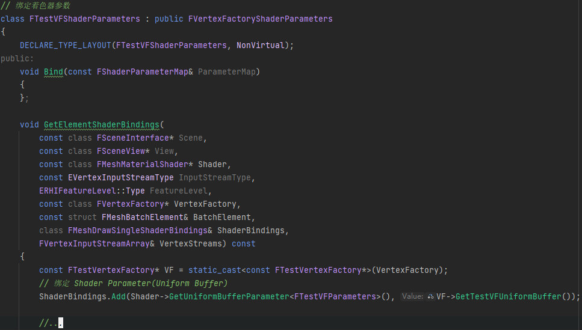

首先要在类开头添加 `DECLARE_TYPE_LAYOUT` 声明

Bind 函数可以将 `LAYOUT_FIELD` 宏声明的成员变量绑定到 Shader 中. 我们之前已经使用 `GLOBAL_SHADER_PARAMETER_STRUCT` 宏来绑定, 所以这个函数留空.

在 `GetElementShaderBindings` 函数中, 我们使用`ShaderBinding.Add(...)`将  VertexFactory 的 UniformBuffer 数据绑定到 Shader 上.

最后还需要添加 `IMPLEMENT_TYPE_LAYOUT` 与 `IMPLEMENT_VERTEX_FACTORY_PARAMETER_TYPE` 宏, 并将其与 VertexFactory 绑定在一起, 这样 ShaderParameters 中的参数绑定就会自动应用到 VertexFactory 对应的 Shader 上.

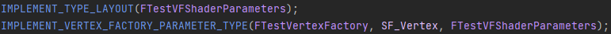

完整源码如下:
<details>
<summary>点击查看完整代码</summary>

```cpp
class FTestVFShaderParameters : public FVertexFactoryShaderParameters
{
	DECLARE_TYPE_LAYOUT(FTestVFShaderParameters, NonVirtual);
public:
	void Bind(const FShaderParameterMap& ParameterMap)
	{
	};
	
	void GetElementShaderBindings(
		const class FSceneInterface* Scene,
		const class FSceneView* View,
		const class FMeshMaterialShader* Shader,
		const EVertexInputStreamType InputStreamType,
		ERHIFeatureLevel::Type FeatureLevel,
		const class FVertexFactory* VertexFactory,
		const struct FMeshBatchElement& BatchElement,
		class FMeshDrawSingleShaderBindings& ShaderBindings,
		FVertexInputStreamArray& VertexStreams) const
	{
		const FTestVertexFactory* VF = static_cast<const FTestVertexFactory*>(VertexFactory);
		// 绑定 Shader Parameter(Uniform Buffer)
		ShaderBindings.Add(Shader->GetUniformBufferParameter<FTestVFParameters>(), VF->GetTestVFUniformBuffer());

		//...
		auto InstanceBuffer = static_cast<const FTestInstanceDataBuffers*>(BatchElement.UserData);
		if(VertexStreams.Num()>0)
		{
			FVertexInputStream* InstanceInputStream = VertexStreams.FindByPredicate(
				[](const FVertexInputStream& InStream)
				{
					return InStream.StreamIndex == 1; // Index set at InitRHI()
				});
			check(InstanceInputStream);
			check(InstanceBuffer->GetBuffer());
			InstanceInputStream->VertexBuffer = InstanceBuffer->GetBuffer();
		}
	}
};
```

</details>

### 结尾
下篇文章会说明如何自定义 VertexFactory.ush 以匹配 C++ 端的 VertexFactory.


